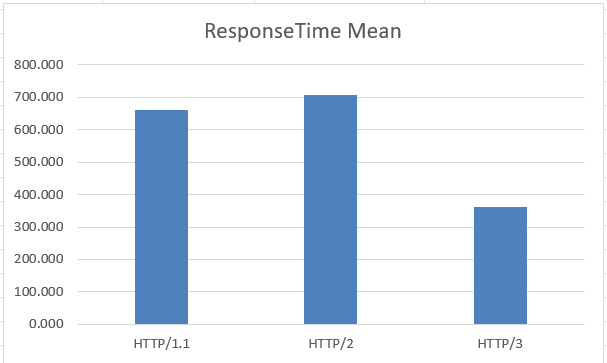
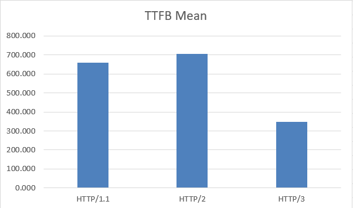
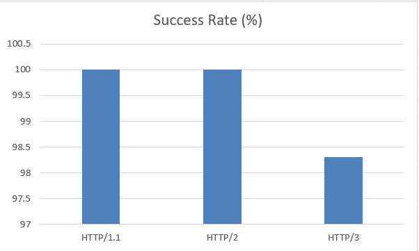

## Performance Evaluation of HTTP/1.1, HTTP/2 and HTTP/3: An Experimental Study with AI-Assisted Analysis

# Overview

This project is an undergraduate research study that evaluates the performance of HTTP/1.1, HTTP/2, and HTTP/3 under the same experimental conditions. The experiment focuses on a single HTML document request and uses repeated measurements to compare the performance of the three protocols.

# Research Objectives

The main objectives of this project are:

- To compare the performance of HTTP/1.1, HTTP/2, and HTTP/3.
- To analyse response time and network performance under the same testing conditions.
- To evaluate protocol performance through repeated experiments.
- To collect a larger dataset for statistical analysis.
- To explore the use of AI-assisted analysis for experimental network performance data.

# Research Questions

This study addresses the following research questions:

- How do HTTP/1.1, HTTP/2, and HTTP/3 differ in performance?
- Which protocol provides lower response time under the tested conditions?
- How do network metrics differ between the three protocols?
- How stable are the protocols during repeated measurements?

# Experimental Methodology

A web-based application was developed using:

- HTML
- CSS
- JavaScript

The backend environment was implemented using:

- Node.js
- Express.js

The website was tested under three HTTP protocol environments:

- HTTP/1.1
- HTTP/2
- HTTP/3

The experiment focuses on a single `index.html` document request.

Each protocol was tested 1000 times using the same target HTML document, resulting in a total of 3000 measurements. The collected data was organised and analysed using Microsoft Excel.

# Performance Metrics

The following metrics were collected and analysed:

| Metric | Description |
|---|---|
| Response Time | Time required to complete the HTTP request |
| TTFB | Time To First Byte |
| RTT | Round Trip Time |
| Jitter | Variation in network delay |
| Packet Loss | Percentage of lost packets |
| Data Size | Amount of transferred data |
| Throughput | Amount of data transferred over time |
| Success Rate | Percentage of successful requests |
| Standard Deviation | Measurement of performance variation |

# Technologies and Tools

### Development

- Node.js
- Express.js
- HTML
- CSS
- JavaScript

### Testing and Analysis

- Microsoft Edge
- Edge DevTools Protocol (CDP)
- QUIC / HTTP/3
- Microsoft Excel
- Git & GitHub
- ChatGPT
- DeepSeek
  
# Experimental Results

The experiment compares HTTP/1.1, HTTP/2 and HTTP/3 using 1000 measurements for each protocol.

The main results include:

- HTTP/3 achieved the lowest average response time.
- HTTP/3 achieved the lowest average TTFB.
- HTTP/1.1 and HTTP/2 achieved a 100% success rate.
- HTTP/3 achieved a 98.3% success rate.
- The collected data was analysed using mean, median and standard deviation.

## Average Page Load Time

## Average TTFB

## Success Rate

# AI-Assisted Analysis

A supplementary AI-assisted analysis was conducted using ChatGPT and DeepSeek.

Two rounds of testing were performed using 10 samples in each round. The AI models were asked to identify the HTTP protocol with the lowest measured response time based on the provided network performance metrics.

| Model | Round 1 | Round 2 |
|---|---:|---:|
| ChatGPT | 70% | 60% |
| DeepSeek | 40% | 60% |

The results show that the AI predictions did not always match the measured experimental results. The AI analysis is included as a supplementary part of the study rather than a replacement for direct network measurements.

# Repository Structure

HTTP-Protocol-Performance-Evaluation/

│── README.md
│── package.json
│── package-lock.json

│── website/
└── Web application source code

│── datasets/
└── Experimental datasets and AI analysis data

│── experiment/
└── Experimental scripts and testing files

│── figures/
└── Experimental result figures

│── results/
└── Statistical analysis, summary and AI prediction results

│── paper/
└── Research paper and related documents

│── HTTP-AI-V2/
└── AI-assisted analysis files

│── node_modules/
└── Project dependencies

------------------------------------------

Yunlong Wang

BSc (Hons) in Computing Science

Griffith College Dublin
