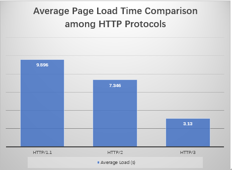
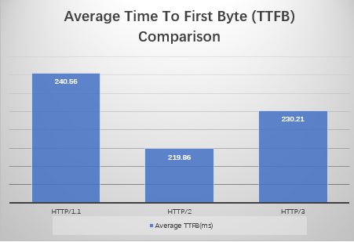
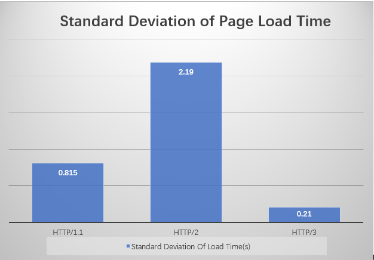
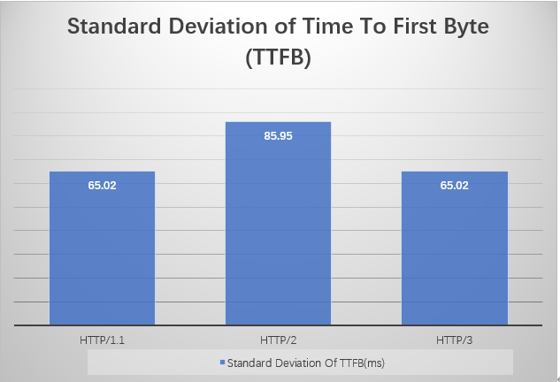

## Performance Analysis of Modern Web Protocols (HTTP/1.1, HTTP/2, and HTTP/3)

# Overview

This project is an undergraduate research study that evaluates the performance differences between modern web protocols: HTTP/1.1, HTTP/2, and HTTP/3.

A web-based image gallery application was developed as the experimental platform. The study investigates how different HTTP protocols affect web application performance by conducting controlled experiments under the same website environment.

The research focuses on analysing webpage loading performance, response latency, and performance stability using experimental measurements.

# Research Objectives

The main objectives of this project are:

- To compare the performance of HTTP/1.1, HTTP/2, and HTTP/3.

- To analyse the impact of different HTTP protocols on web application loading performance.

- To evaluate protocol stability through repeated experiments.

- To investigate the practical advantages of modern web protocols.

# Research Questions

This study addresses the following research questions:

- How do HTTP/1.1, HTTP/2, and HTTP/3 differ in web performance?

- Which protocol provides better webpage loading performance?

- How stable are different HTTP protocols under repeated measurements?

# Experimental Methodology

A web gallery application was developed using:

- HTML

- CSS

- JavaScript

The backend environment was implemented using:

- Node.js

- Express.js

The website was tested under three HTTP protocol environments:

- HTTP/1.1

- HTTP/2

- HTTP/3

Each protocol was tested 10 times under the same experimental conditions, resulting in a total of 30 measurements.

# Performance Metrics

The following metrics were collected and analysed:

Metric	Description
Requests	             ---Number of HTTP requests generated
Transferred	             ---Amount of transferred data
Resources	             ---Total resources loaded
TTFB	                 ---Time To First Byte
DOMContentLoaded	     ---Time required to parse HTML and build DOM
Load Time	             ---Total webpage loading time
Standard Deviation	     ---Performance stability measurement

# Technologies and Tools

- Development

- Node.js

- Express.js

- HTML

- CSS

- JavaScript

Testing and Analysis:

- Google Chrome Developer Tools

- Cloudflare (HTTP/3 and QUIC support)

- Microsoft Excel (data analysis)

- Git & GitHub

# Experimental Results

The experiment compared HTTP/1.1, HTTP/2 and HTTP/3 using the same web application.

The results show:

- HTTP/3 achieved the lowest average page load time.

- HTTP/2 improved performance compared with HTTP/1.1.

- HTTP/3 demonstrated the highest loading stability.

## Average Page Load Time

## Average TTFB

## Performance Stability

# Repository Structure
Performance-Analysis-of-Modern-Web-Protocols/

│── README.md

│── website/
└── Web application source code

│── datasets/
├── raw_HTTP1.1 data
├── raw_HTTP2 data
└── raw_HTTP3 data
└── integral data

│── experiment/
└──Testing and Screenshots

│── results/
└── Statistical analysis and summary

│── figures/
└── Experimental result figures

│── paper/
└── Research paper

# Future Work

Future improvements may include:

Testing additional geographic locations.
Evaluating performance under different network conditions.
Analysing additional metrics such as throughput and packet loss.
Expanding experiments using larger web applications.
Author

------------------------------------------

Yunlong Wang

BSc (Hons) in Computing Science

Griffith College Dublin
